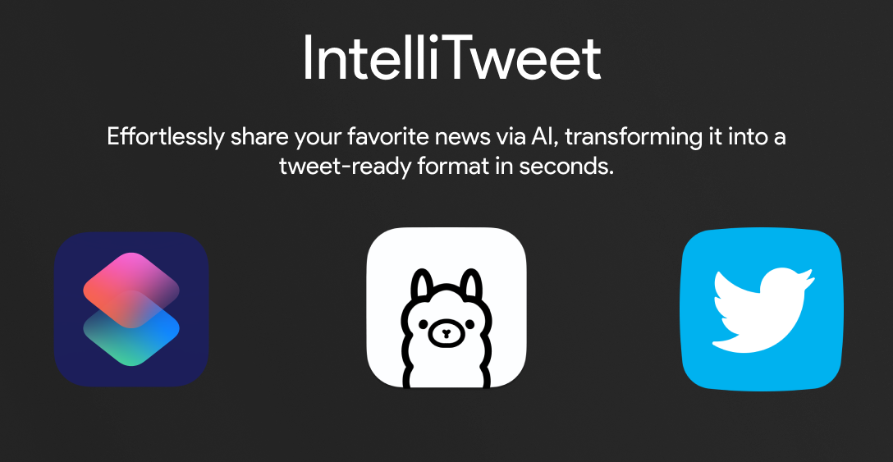
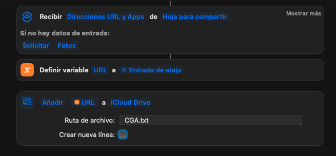

# IntelliTweet



Effortlessly disseminate your preferred news item from your device to your Twitter account within seconds, facilitated by the seamless transformation of the information into a tweet-ready format through the application of advanced artificial intelligence.

Share a piece of news from your iPhone/iPad/Mac using a shortcut and IntelliTweet will automatically read the website for you, check the important information and publish it into your Twitter/X account within seconds.

## Requirements

> [!NOTE]  
> To run this project, you will need to have OLLAMA installed on your system.

Find Ollama on: [Ollama Repository](https://github.com/jmorganca/ollama) and [Ollama Official Website](https://ollama.ai)

## Operation

1. IntelliTweet Receives a URL from a news media outlet through a Siri shortcut.
2. Reads the website to obtain the title, description, and image.
3. Asseses this information to a local language model (LLM).
4. Uses the Twitter API V2 to post the tweet to the account.

## Installation and Usage

To install and run this project, follow these steps:

1. Clone the repository on your local machine.
2. Make sure Ollama is running.
3. Install the necessary dependencies using the requirements.txt file.
4. Configure the Twitter API credentials (create a `.env` file as follows)
```
TW_CONSUMER_KEY=XXXXXXXXXXXXXXXXXXXXXX
TW_CONSUMER_SECRET=XXXXXXXXXXXXXXXXXXXXXX
TW_ACCESS_TOKEN=XXXXXXXXXXXXXXXXXXXXXX-XXXXXXXXXXXXXXXXXXXXXX
TW_ACCESS_TOKEN_SECRET=XXXXXXXXXXXXXXXXXXXXXX
TW_BEARER_TOKEN=XXXXXXXXXXXXXXXXXXXXXXXXXXXXXXXXXXXXXXXXXXXX
```
5. Update line 3 on `script.sh` file with the path of the cloud file you are using.
6. Update line 17 on `script.sh` file with the path of the python script (`main.py`).
6. Run the script.sh file on your local terminal.

## Siri shortcut configuration

In order to make IntelliTweet work you have to configure a siri shortcut as follows:



Make sure you have the "Create new line" option not marked and file to the path is in a cloud provider (I'm using iCloud).

## Website configuration

In order to make IntelliTweet work with your favorite news media outlets go to `scraper.py` and add your desired websites:

```
elif '9to5mac' in url[:25]:
        title = soup.find('h1', class_='h1')
        image_element = soup.find('img', class_='skip-lazy')
        content = soup.find('p')
```
For example this scans 9to5mac website to extract the title, image url and content. Ypu may add some custom classes (You can extract them from your browser using inspect element).

## Language configuration
IntelliTweet is preonfigured to work in spanish but you can change that easily by changing the prompt (`def create_prompt(title, content):`) and by changing the language in:
```
def translate(input):
    translator = Translator(to_lang="es")
    translation = translator.translate(input)
    return translation
```

## Future Improvements
- [ ] Add some parameters to a config file (language, model to be used, even different Twitter accounts (changing .env))
- [ ] Better prompting
- [X] Tests
